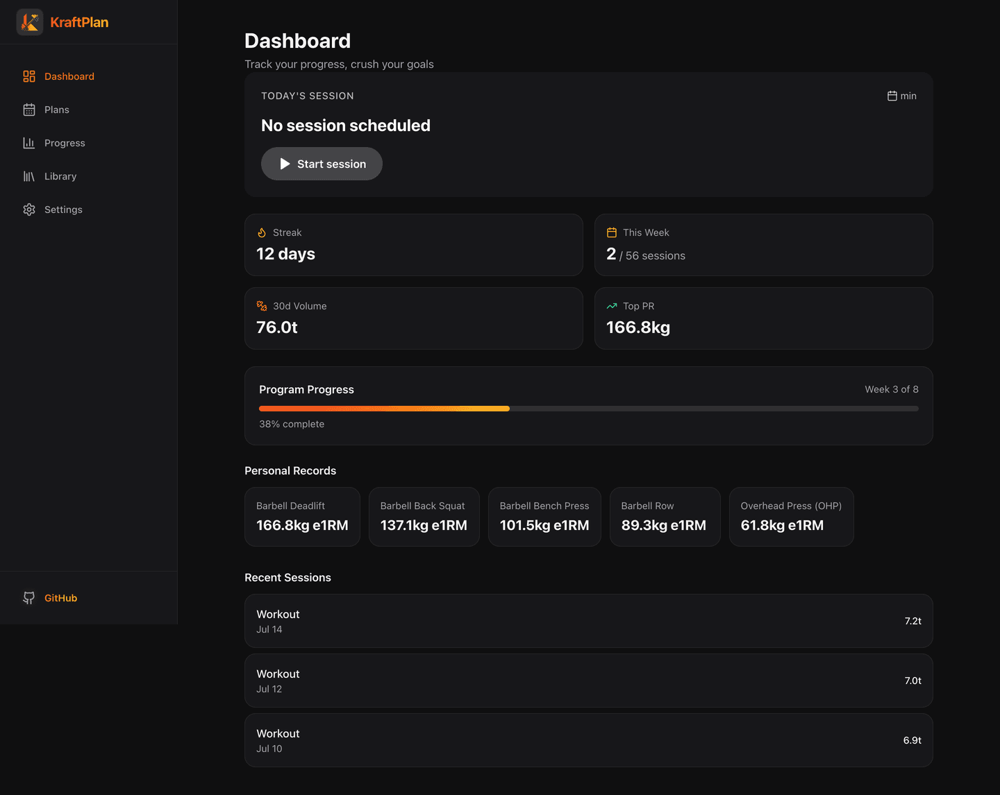
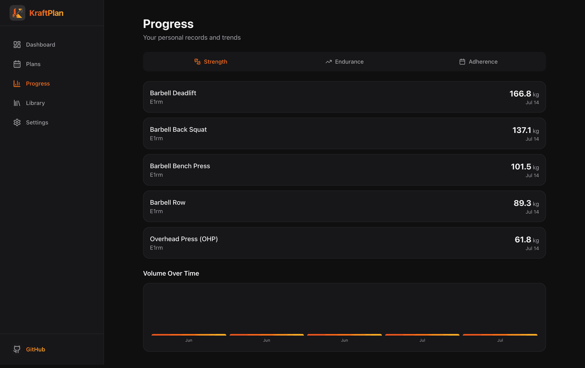
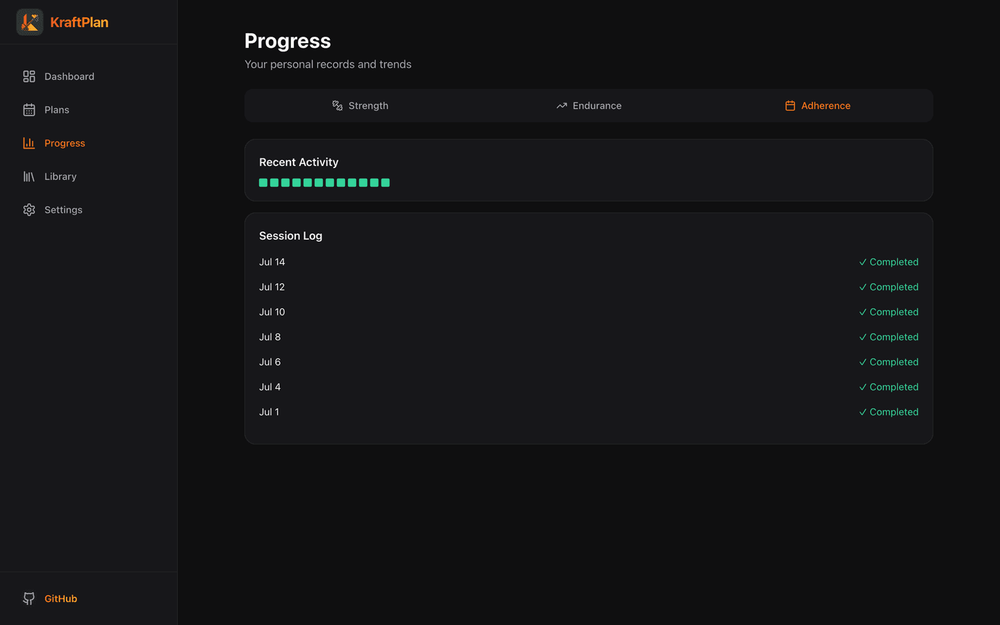
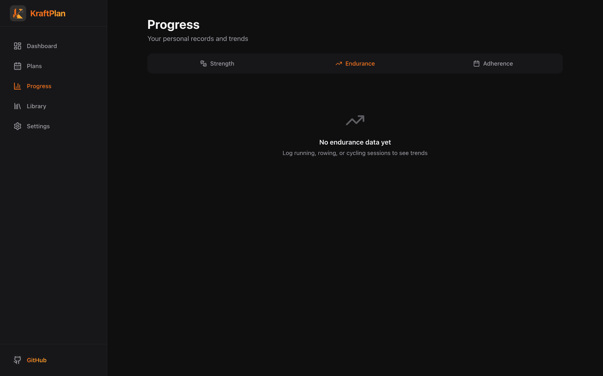
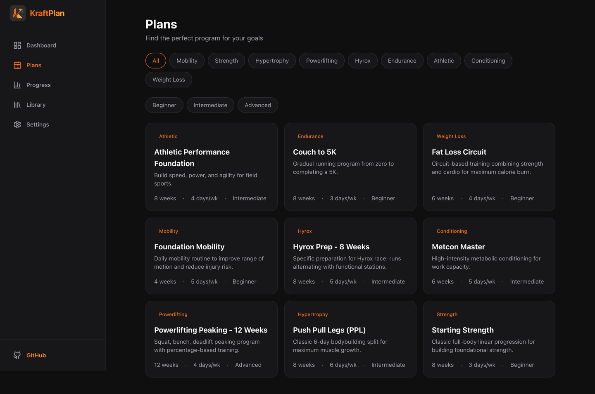
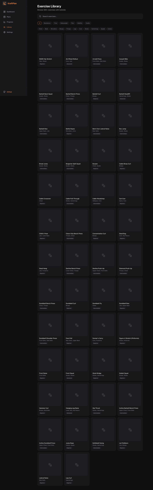
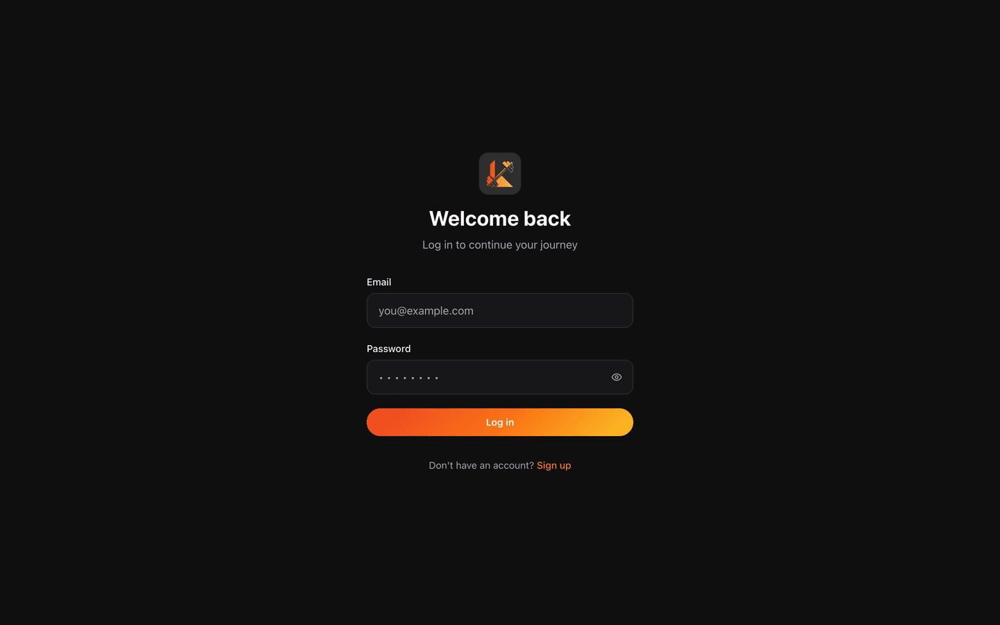
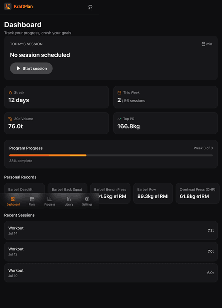

# KraftPlan — AI-Powered Gym Workout Planner & Tracker

### 🔗 Live app: **[kraftplan.pages.dev](https://kraftplan.pages.dev)**
_Hosted on Cloudflare Pages (web) + Cloudflare Workers (API) + Neon (DB) — all free tier, always-on._

Kraftplan is a full-stack web application for discovering, customizing, and executing structured gym workout plans across multiple training disciplines. It provides an interactive workout player with set-by-set logging, rest timers, tutorial content, and a progress dashboard that tracks personal records and trends.

**Front-end reference:** [fitonist-app.webflow.io](https://fitonist-app.webflow.io/) — dark, energetic, mobile-first fitness UI.

**Brand & design system:** deep-charcoal UI with the KraftPlan gradient sampled from the logo — red `#EF4423` → orange `#F97316` → amber `#FBBF24`. Dark-mode-first, WCAG AA, one consistent palette across every page (design tokens in `apps/web/src/styles/tokens.css`).

---

## 🚀 Live site & deployment

KraftPlan runs on a **100% free, no-credit-card, zero-cold-start** stack — everything
deploys with `wrangler` + a Cloudflare API token (no repo connection needed):

| Layer | Host | URL |
|---|---|---|
| Web app | **Cloudflare Pages** | **[kraftplan.pages.dev](https://kraftplan.pages.dev)** |
| API | **Cloudflare Workers** (`apps/worker`) | `https://kraftplan-api.<subdomain>.workers.dev` |
| Database | **Neon** (Postgres over HTTP) | provisioned & seeded ✅ |

> The `kraftplan.pages.dev` link goes live the moment the Pages deploy runs
> (`wrangler pages deploy` — see [DEPLOYMENT.md](./DEPLOYMENT.md)).

The API is a single always-on Cloudflare Worker (Hono + `drizzle-orm/neon-http`) — **no cold
starts**. A Node/Fastify build (`apps/api`) is kept as an optional Render fallback.
**Step-by-step guide → [DEPLOYMENT.md](./DEPLOYMENT.md)** (Neon, Workers, Pages, CI/CD, scaling).

---

## 📸 Screenshots

### Dashboard — today's session, streak, volume, PRs & program progress


### Progress analytics

| Strength (1RM records + volume trend) | Adherence (activity heatmap + session log) |
|:--:|:--:|
|  |  |

| Endurance (pace & distance trends) | Plan catalog |
|:--:|:--:|
|  |  |

| Exercise library (81 exercises) | Sign in |
|:--:|:--:|
|  |  |

### Mobile — gym-ready, one-hand reachable
<p align="center"></p>

---

## System Architecture

```
┌──────────────────────────────────────────────────────────────────┐
│                    Web — Next.js 14 (App Router)                   │
│      Dashboard · Plans · Workout Player · Library · Progress       │
│                  Cloudflare Pages (global edge)                    │
└────────────────────────────┬─────────────────────────────────────┘
                             │ HTTPS (REST + JWT)
                             ▼
┌──────────────────────────────────────────────────────────────────┐
│                 API — Hono on Cloudflare Workers                   │
│   /auth · /plans · /workouts · /progress · /dashboard · /exercises │
│              always-on · zero cold start (apps/worker)             │
│         (optional Node/Fastify build: apps/api → Render)           │
└────────────────────────────┬─────────────────────────────────────┘
                             │ drizzle-orm/neon-http
                             ▼
                 ┌────────────────────────────┐
                 │   Neon — serverless Postgres │
                 │   (HTTP driver, pooled)     │
                 └────────────────────────────┘
```

### Frontend
- **Next.js 14 (App Router)** — Server Components for fast loads, Client Components for interactive workout player
- **Tailwind CSS** — Dark-mode-first design tokens inspired by Fitonist
- **TanStack Query** — Server state with optimistic updates for set logging
- **Zustand** — Client state for the workout player (persisted to IndexedDB)
- **Recharts** — Progress charts (volume, adherence, PR trends)
- **Radix UI** — Accessible primitives (Dialog, Tabs, Progress)

### Backend API
One always-on Cloudflare Worker (`apps/worker`, **Hono**) exposes the whole API. It's a
port of the original five Fastify services (`services/*`), which still power the optional
Node build (`apps/api`) for a Render deployment.

| Domain | Endpoints | Responsibility |
|---|---|---|
| **Auth** | `/auth/*` | Register, login (PBKDF2 via WebCrypto + JWT), profile |
| **Plans** | `/plans`, `/users/me/plan` | Catalog, assignment, today's-session resolution |
| **Workouts** | `/workouts/*` | Session lifecycle, idempotent set logging |
| **Progress** | `/progress/*`, `/dashboard` | PRs (computed on completion), volume/adherence/endurance |
| **Library** | `/exercises/*` | Full-text exercise search + detail |

- **PBKDF2 (WebCrypto)** password hashing runs identically on Workers and Node — no native
  `argon2`, so the same hashes work across both backends and the shared DB.
- The Worker decodes the Bearer JWT into an `x-user-id` context for downstream queries.

### Database
- **Neon** serverless Postgres. The Worker uses **`drizzle-orm/neon-http`** (stateless
  fetch-per-query, ideal for Workers); the Node build uses pooled `postgres-js`.
- **Drizzle ORM** — type-safe SQL. Tables: `users`, `plans`, `plan_weeks`, `plan_days`,
  `plan_blocks`, `block_exercises`, `exercises`, `exercise_alternatives`,
  `user_plan_assignments`, `workout_sessions`, `workout_sets`, `personal_records`,
  `event_outbox`.
- `workout_sets` uses idempotency keys to prevent duplicate logs on retry.

---

## Setup & Running

### Prerequisites
- Node.js >= 20
- pnpm 9+ (`npm install -g pnpm@9`)
- A Postgres database — a free **[Neon](https://neon.tech)** project is recommended (no Docker needed)

### Quick Start (with Neon — no Docker)

```bash
# 1. Install dependencies
pnpm install

# 2. Configure env — put your Neon connection strings + a JWT secret in .env
cp .env.example .env    # then edit DATABASE_URL / DATABASE_URL_UNPOOLED / JWT_SECRET

# 3. Push schema and seed (81 exercises, 9 plans)
pnpm db:push
pnpm db:seed

# 4. Run the unified API (:4001) and the web app (:3000)
pnpm dev:api     # in one terminal
pnpm dev:web     # in another
```

Open http://localhost:3000. Redis is **not required** — it is unused at runtime and the
app runs fully on Postgres alone.

### Unified API

All backend routes are combined into a single deployable, **`apps/api`** (`@kraftplan/api`),
which mounts every service's routes in one Fastify process — ideal for free-tier hosting.
The individual `services/*` still exist and can be run separately if desired.

---

## Project Structure

```
D:\Gym ai project\
├── apps/web/                    # Next.js frontend
│   ├── src/app/
│   │   ├── (auth)/login, register    # Auth pages
│   │   ├── onboarding/               # 5-step wizard
│   │   └── (app)/
│   │       ├── dashboard/            # Today's session, stats, PRs
│   │       ├── plans/                # Catalog + detail with weeks
│   │       ├── workout/[sessionId]/  # Interactive workout player
│   │       ├── progress/             # PRs, volume, adherence charts
│   │       ├── library/              # Exercise search + filter
│   │       └── settings/
│   ├── components/ui/           # Button, Card (design-token based)
│   ├── components/player/       # RestTimer, SetLogger
│   ├── stores/playerStore.ts    # Zustand workout player state
│   └── lib/api/client.ts        # Typed API client
├── packages/
│   ├── shared/src/              # Zod schemas, constants, formulas
│   │   ├── schemas/             # user, plan, exercise, workout, progress
│   │   └── constants.ts         # Epley 1RM, unit conversion
│   └── db/src/
│       ├── schema/index.ts      # 14 Drizzle table definitions
│       └── seed.ts              # 300+ exercises, 9 plans seeding
├── services/
│   ├── auth/                    # Fastify — JWT, argon2
│   ├── plans/                   # Catalog, assignments, day resolution
│   ├── workouts/                # Session lifecycle, set logging
│   ├── progress/                # PR computation, dashboard aggregation
│   └── library/                 # Full-text search, exercise detail
├── docker/                      # Docker Compose + Dockerfiles
├── docs/                        # PRD, Design, Architecture docs
└── scripts/
```

---

## Key Features

### 9 Training Modalities
Mobility, Strength, Hypertrophy, Powerlifting, Hyrox, Endurance, Athletic Performance, Conditioning, Weight Loss

### Interactive Workout Player
- Sequential exercise-by-exercise UI with set logging
- Per-set inputs: weight (kg/lb), reps, RPE, time, distance
- SVG countdown rest timer with skip/+15s
- PR detection with celebration
- Offline-tolerant (IndexedDB queue, idempotent sync)

### Progress Dashboard
- Today's session card with one-tap start
- Streak tracking, weekly adherence, 30-day volume
- Program progress (week X of Y with % bar)
- PR highlights with delta from previous
- Volume over time chart
- Session calendar heatmap

### Exercise Library
- 81 curated exercises, 300+ planned
- Full-text search by name and muscle
- Filters by category, muscle, equipment, difficulty
- Detail view with instructions, coaching cues, common mistakes
- Exercise alternatives system

---

## Tech Stack

| Layer | Choice |
|---|---|
| Monorepo | pnpm workspaces + Turborepo |
| Frontend | Next.js 14 (App Router) + TypeScript |
| Styling | Tailwind CSS + design tokens |
| State | TanStack Query + Zustand |
| Charts | Recharts |
| Backend | Fastify + TypeScript |
| ORM | Drizzle ORM |
| Database | PostgreSQL 16 (Neon) |
| Cache | Redis 7 |
| Auth | JWT (jose) + argon2 |
| Infrastructure | Docker Compose |
| CI/CD | GitHub Actions |

---

## Design

Dark-mode-first UI inspired by the Fitonist reference. Design tokens control all colors, typography, and spacing — consistent across light/dark themes.

**Colors:** Dark base (`#0B0E14`), surface (`#141925`), with electric blue (`#3D8BFF`) → violet (`#8E6FFF`) gradient accents.
**Typography:** Inter (UI) + Space Grotesk (display headings).
**Patterns:** Mobile-first with bottom nav, desktop left sidebar, card-based layouts.

---

## License

MIT
